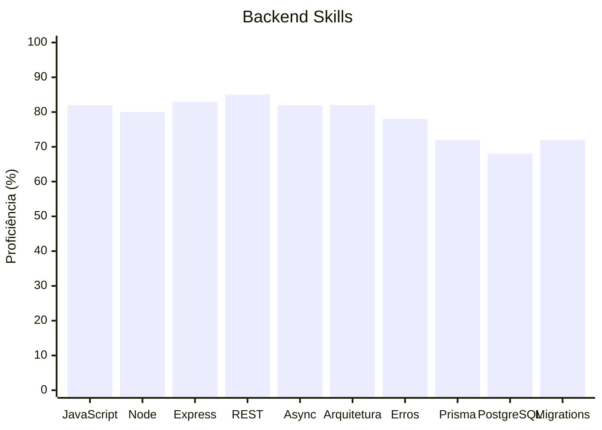
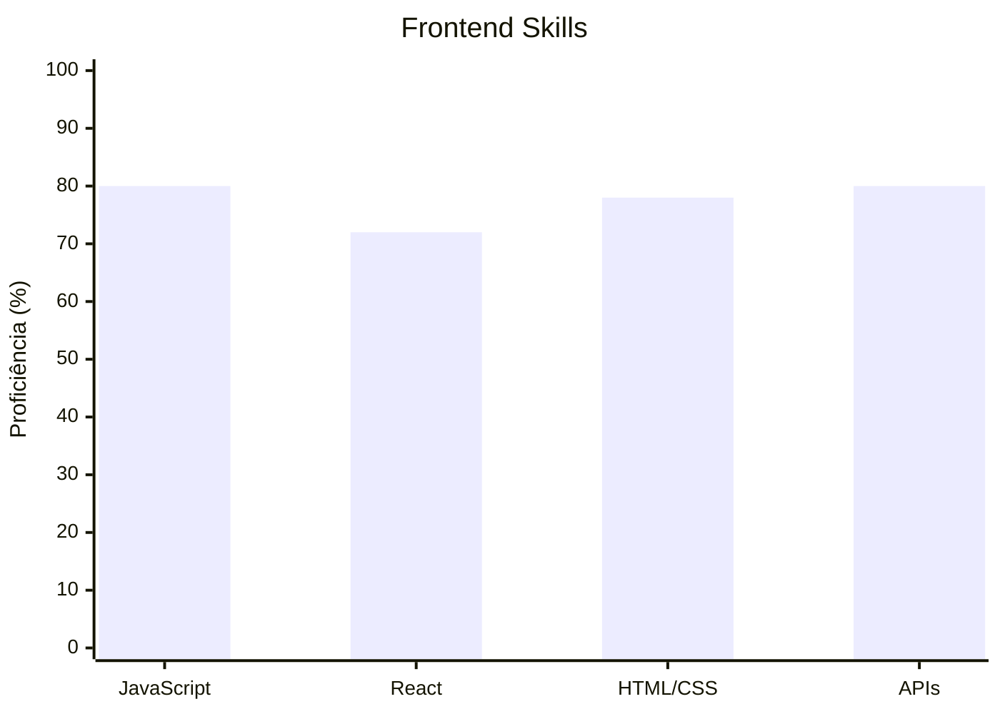

<div align="center">

# 👋 Olá, eu sou Pedro Henrique

### Backend / Full Stack Developer em formação

Desenvolvendo aplicações com **JavaScript, Node.js, Express, React, Prisma e PostgreSQL**, com foco atual em backend e APIs REST.

[](https://github.com/PedrinSX77)

</div>

---

## 🚀 Sobre mim

Sou desenvolvedor Full Stack em formação, atualmente aprofundando minha base em **backend com JavaScript e Node.js**.

Meu aprendizado é orientado à prática: desenvolvimento de projetos, debugging, arquitetura, banco de dados e evolução gradual de aplicações reais.

Atualmente trabalho com APIs organizadas no fluxo:

```text
Route → Controller → Service → Prisma → PostgreSQL
```

🎯 Objetivo: conquistar minha primeira oportunidade como **Backend Developer Jr** ou **Full Stack Developer Jr**.

---

## 🛠️ Stack

### Backend


`Node.js` `Express` `REST APIs` `ES Modules` `Async/Await` `Prisma ORM` `PostgreSQL` `Migrations`

### Frontend


`React` `JavaScript` `HTML5` `CSS3` `CSS Modules` `Fetch API`

### Ferramentas


`Git` `GitHub` `npm` `VS Code` `psql`

---

## 📊 Skill Dashboard

> Autoavaliação baseada nos conceitos que já estudei e apliquei em projetos.

### Backend



### Frontend



| Nota | Proficiência |
|:---:|:---|
| A++ | 95–100% |
| A+ | 90–94% |
| A | 80–89% |
| A- | 75–79% |
| B+ | 70–74% |
| B | 60–69% |
| C | 40–59% |
| D | <40% |

---

## 🧠 Conhecimentos aplicados

- APIs REST e CRUD completo
- Request / Response e métodos HTTP
- Route Params e Query Params
- Middlewares
- Promises e Async/Await
- Tratamento centralizado de erros
- Arquitetura `Route → Controller → Service`
- Separação de responsabilidades
- ES Modules
- Variáveis de ambiente
- PostgreSQL
- Prisma ORM
- Models e Primary Keys
- IDs autoincrementais
- Filtros dinâmicos
- Persistência de dados
- Migrations
- Git e versionamento

---

## 📌 Projeto em destaque

### 🗄️ CRUD API — Node.js + Express + Prisma + PostgreSQL

[](https://github.com/PedrinSX77/CRUD-Api-Node.js)

API REST de produtos que evoluiu de um CRUD em memória para uma aplicação com **persistência real em PostgreSQL**.

**Principais recursos:**

- CRUD completo
- Arquitetura em camadas
- Prisma ORM
- PostgreSQL
- Migrations
- Filtros por query parameters
- Validação de dados
- Tratamento de erros
- Registros inexistentes → `404`
- ES Modules
- Async/Await

```text
Cliente
  ↓
Express
  ↓
Route
  ↓
Controller
  ↓
Service
  ↓
Prisma
  ↓
PostgreSQL
```

---

## 📈 Atualmente estudando

```text
Relacionamentos de banco
        ↓
Autenticação e autorização
        ↓
Validação
        ↓
Testes
        ↓
Segurança
        ↓
Deploy
```

Depois da consolidação do backend JavaScript:

**TypeScript → Java**

---

## 📚 Outros projetos

### 💱 Conversor de Moedas
Consumo de API externa, JavaScript e interface responsiva.

### 📝 Lista de Tarefas
CRUD frontend, DOM, JavaScript e organização de código.

---

## 📫 Contato

**GitHub:** [@PedrinSX77](https://github.com/PedrinSX77)

---

<div align="center">

### 🚀 Código, prática e evolução contínua.

</div>
